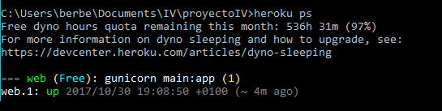
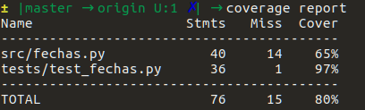
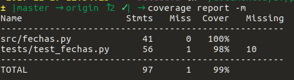
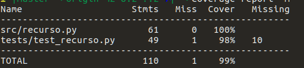
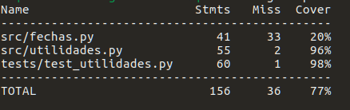

# Proyecto de Infraestructura Virtual

> Aplicación en Python para reserva de recursos de la facultad.

[](https://travis-ci.org/berbus/proyectoIV)
[](https://radiant-earth-69154.herokuapp.com/)
[](https://opensource.org/licenses/MIT)


Aplicación desarrollada en Python 3 para la gestión de reservas de diferentes recursos de la facultad. Inicialmente, se propone ofrecer servicio para reservar el futbolín y las mesas rojas, con la posibilidad de ampliar la funcionalidad a otros elementos más adelante.

Queda por determinar la forma más conveniente de almacenar la información de las reservas así como la representación más conveniente para las fechas y horas de las reservas.

Para llevar a cabo los tests sobre el código se va a utilizar la biblioteca `unittest` de Python. Estos tests se ejecutarán a través de `Travis CI`. Los tests se encuentran el la carpeta *./tests*.

La estructura de la base de datos se crea y gestiona conuna base de datos remota que usa MongoDB que se estructura de la siguiente forma:
- Una colección *users_iv* que almacena documentos con parejas de usuarios (user) y sus contraseñas (pass) de momento en texto plano. No puede haber dos usuarios con el mismo nombre.

- Una colección *futbolin* en la que se almacenan documentos con un identificador (id) de la reserva, la fecha en formato AAAAMMDD, la hora en forma HHMM y el correo de quién la haya realizado (email). El id consiste en

```python
str(año) + str(mes) + str(dia) + ":" + str(hora) + str(minutos)
```

Toda la documentación de lo hecho hasta ahora se incluye en sus lugares correspondientes.

Se pueden consultar los horarios (primera interacción con la base de datos).

Subida a Heroku [aquí](https://radiant-earth-69154.herokuapp.com/), pero en proceso...

Para comprobar que la aplicación se está ejecutando podemos comprobar el número de dynos (contenedores de Heroku) que se están ejecutando con la orden del CLI *heroku ps*:



Cosas que ya hace la aplicación:

- [X] Base de datos funcionando (MonoDB).
- [X] Login de usuarios.
- [X] Registro de usuarios.
- [X] Los usuarios pueden cambiar su contraseña.

Despliegue https://radiant-earth-69154.herokuapp.com/

Despliegue desde GitHub:


## Ampliación de la cobertura de los tests
Usando coverage.py, se han repasado todos los archivos que contienen código Python para asegurar la cobertura completa de los tests unitarios. El resultado ha sido una cobertura de casi el 100% (el porcentaje que falta es código que sólo se ejecuta en Windows).

#### Resultados de coverage antes de la ampliación


#### Resultados de coverage después de la ampliación





## Contenedores

La imagen de DockerHub usa el archivo Dockerfile de este repositorio.  Partiendo de la imagen oficial para Python, se clona este repositorio, se instalan los requisitos especificados en ``requeriments.txt`` y se lanza la aplicación usando el puerto 8000.

Por otro lado, desde Heroku, se hace un despliegue del contenedor siguiendo [estas instrucciones](https://devcenter.heroku.com/articles/container-registry-and-runtime) y haciendo uso del comando  ``heroku stack:set heroku-16``.


DockerHub https://hub.docker.com/r/berbus/proyectoiv/

Contenedor https://radiant-earth-69154.herokuapp.com/
