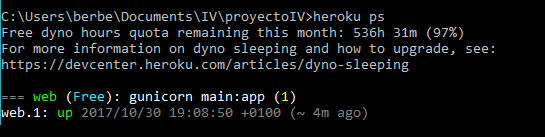

# Proyecto de Infraestructura Virtual

> Aplicación en Python para reserva de recursos de la facultad.

[](https://travis-ci.org/berbus/proyectoIV)
[](https://radiant-earth-69154.herokuapp.com/)
[](https://opensource.org/licenses/MIT)
[](https://scrutinizer-ci.com/g/berbus/proyectoIV/?branch=master)


Aplicación desarrollada en Python 3 para la gestión de reservas de diferentes recursos de la facultad. Inicialmente, se propone ofrecer servicio para reservar el futbolín y las mesas rojas, con la posibilidad de ampliar la funcionalidad a otros elementos más adelante.

Queda por determinar la forma más conveniente de almacenar la información de las reservas así como la representación más conveniente para las fechas y horas de las reservas.

Para llevar a cabo los tests sobre el código se va a utilizar la biblioteca `unittest` de Python. Estos tests se ejecutarán a través de `Travis CI`. Los tests se encuentran el la carpeta *./tests*.

La estructura de la base de datos se crea y gestiona con la biblioteca de Python `sqlite3`, se encuentra en la carpeta *./src* y se estructura de la siguiente forma:
- Una tabla *futbolin* en la que se almacenan un identificador (id) de la reserva, la fecha en formato AAAAMMDD, la hora en forma HHMM y el correo de quién la haya realizado (email). El id consiste en


```python
str(año) + str(mes) + str(dia) + ":" + str(hora) + str(minutos)
```

Toda la documentación de lo hecho hasta ahora se incluye en sus lugares correspondientes.

Se pueden consultar los horarios (primera interacción con la base de datos).

Subida a Heroku [aquí](https://radiant-earth-69154.herokuapp.com/), pero en proceso...

Para comprobar que la aplicación se está ejecutando podemos comprobar el número de dynos (contenedores de Heroku) que se están ejecutando con la orden del CLI *heroku ps*:


